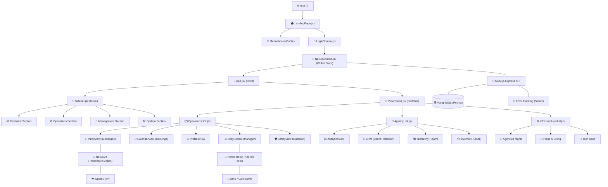

# 🛰️ Nexus Hub: Application Map (Obsidian Graph Style)

Tato mapa znázorňuje architekturu systému, tok dat a hierarchii komponent. Uzly jsou logicky propojeny tak, jak spolu interagují v kódu.

## 🗺️ Interaktivní Graf Architektury

## 📄 Detailní Popis Uzlů

### 1. Veřejná Zóna (Pre-Login)
- **`LandingPage.jsx`**: Hlavní brána. Nyní obsahuje přepínač na `ManualView`.
- **`ManualView`**: Nově přidaný průvodce, který je přístupný jak veřejně, tak z vnitřního menu.
- **`LoginScreen.jsx`**: Zajišťuje autentizaci a registraci (nová agentura / připojení k týmu).

### 2. Jádro Aplikace (Post-Login)
- **`NexusContext.jsx`**: Mozek aplikace. Drží informace o přihlášeném operátorovi, aktivní agentuře, překladech a synchronizaci dat.
- **`Sidebar.jsx`**: Dynamické menu, které se mění podle role (App Owner vidí vše, Operátorka jen své profily).
- **`ViewRouter.jsx`**: Přepínač, který na základě `activeTab` vykresluje konkrétní moduly.

### 3. Funkční Celky (Units)
- **Operations Unit**: Každodenní práce. Tady se odehrává 90 % interakcí (chat, kalendář, bezpečí modelky).
- **Agency Unit**: Manažerský pohled. Sledování zisků, správa CRM databáze a hierarchie týmu.
- **Infrastructure Unit**: Technické nastavení celého systému, licencování a správa jednotlivých agentur.

### 4. Datový Tok & Hardware
- **Nexus Relay**: Unikátní propojení mezi webovým dashboardem a reálným Android telefonem přes šifrovaný socket.
- **AI Engine**: Integrovaný systém pro automatické překlady a (připravované) inteligentní odpovědi.
